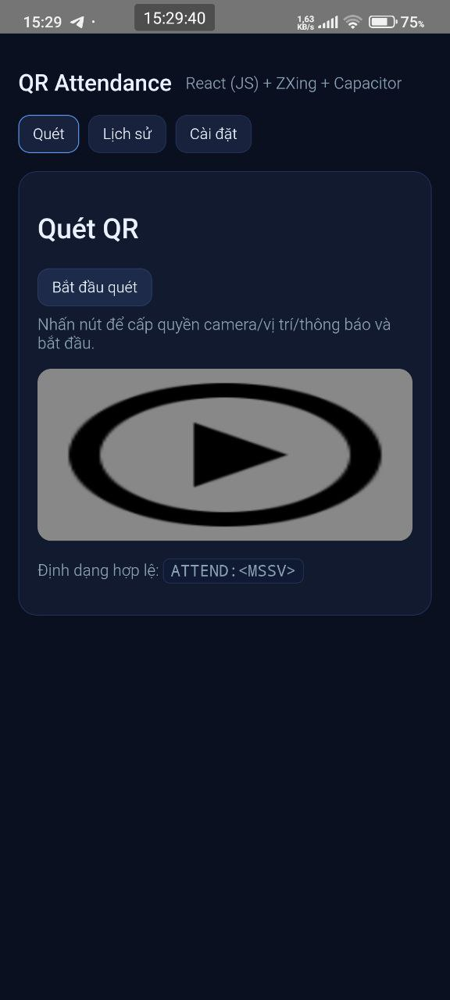
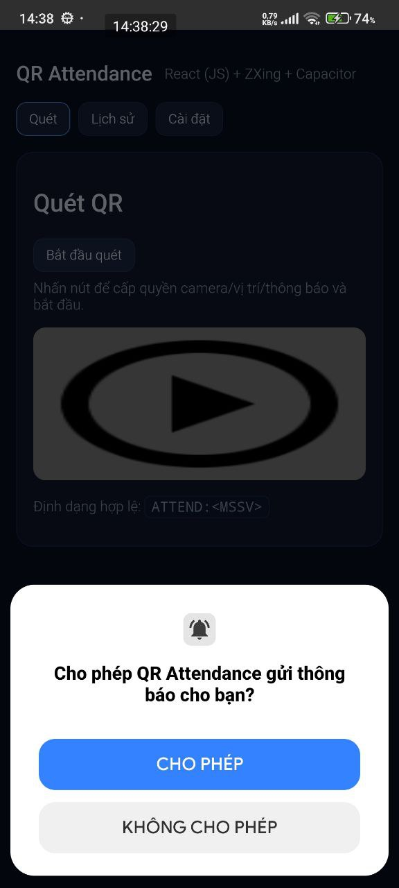
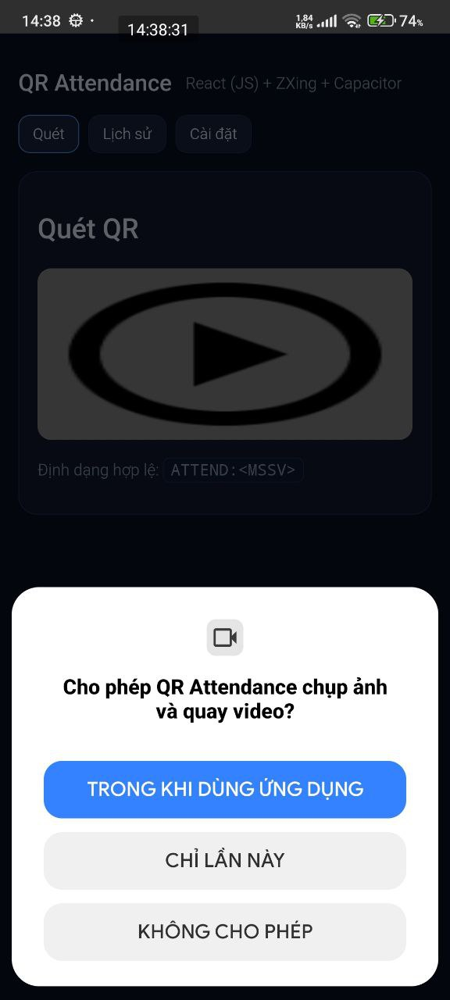
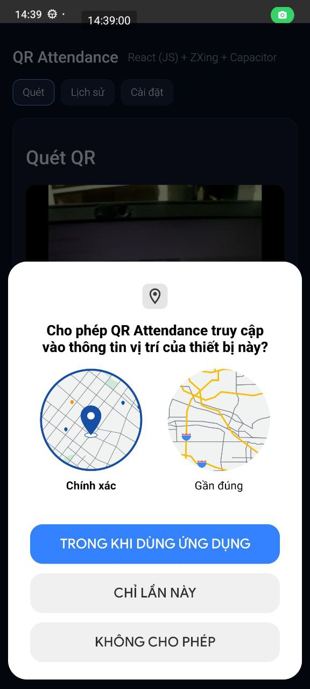
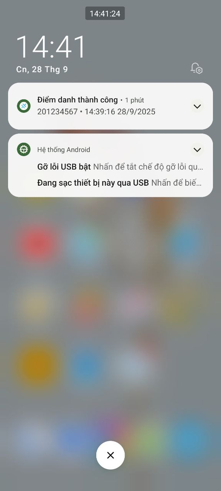
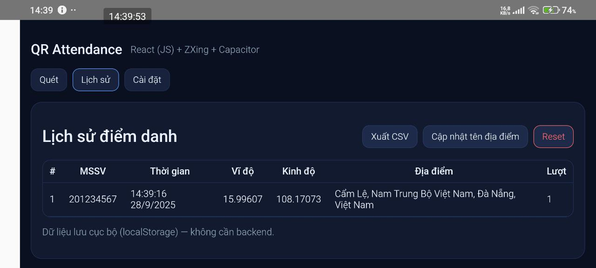
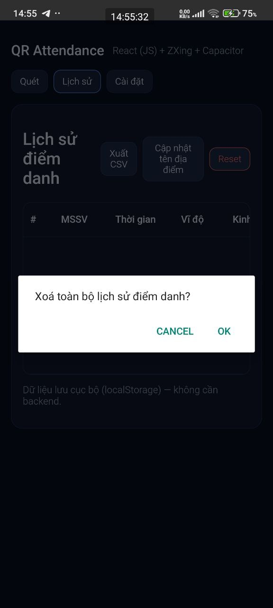
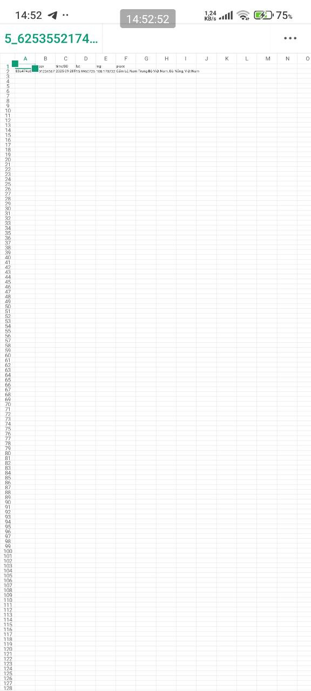

## Thông tin sinh viên
- Lê Cẩm Bình
- MSSV: 22IT.EB007
- Lớp HP: Phát triển ứng dụng di động đa nền tảng (2)

# QR Attendance (React + Vite + ZXing + Capacitor)
- Ứng dụng điểm danh bằng QR đa nền tảng Android/iOS/Web.
- Quét định dạng ATTEND:<MSSV>, lưu lịch sử (MSSV, thời gian, tọa độ, tên địa điểm), Xuất CSV, Reset, chống quét trùng, rung và thông báo native.
- Dữ liệu lưu cục bộ (localStorage) — không cần backend.

## Tính năng chính
- Quét QR với ZXing (@zxing/library), ưu tiên camera sau.
- Lưu lịch sử: id, mssv, timeISO, lat, lng, place.
- Reverse geocoding (BigDataCloud, không cần API key) → hiển thị tên địa điểm.
- Xuất CSV:
  - Mobile (native): Filesystem + Share → mở share sheet để lưu/chia sẻ.
  - Web: download.
- Chống quét trùng: daily: 1 lần/ngày/MSSV
- Haptics (rung) + Local Notifications native (Capacitor).
- UI gọn – không crash, xử lý quyền đúng lúc.

## Tech Stack
- React + Vite (JS)
- Capacitor: core + Android/iOS platforms
- ZXing (@zxing/library)
- Plugins Capacitor:
  - @capacitor/geolocation
  - @capacitor/haptics
  - @capacitor/local-notifications
  - @capacitor/filesystem
  - @capacitor/share

## Cấu trúc thư mục
```
src/
  App.jsx
  main.jsx
  styles.css
  components/
    Scanner.jsx        # Màn hình quét, haptics + notifications, enrich vị trí
    History.jsx        # Bảng lịch sử, CSV export, backfill tên địa điểm
  lib/
    storage.js         # load/save, upsert, update-by-id, chống trùng
    csv.js             # toCSV, exportCSV (native & web)
    permissions.js     # fallback web: Notification + Geolocation
    geoName.js         # reverse geocoding (BigDataCloud)
    native.js          # wrapper Capacitor: Geolocation/Haptics/Notifications
    format.js          # fmtCoord(...) để rút gọn toạ độ
```
- Khởi tạo Capitor
```
npx cap init "QR Attendance" com.example.qrattendance --web-dir=dist
npx cap add android
npx cap add ios
```

## Yêu cầu môi trường
- Node.js 18+
- Java JDK 21 (JAVA_HOME & Android Studio dùng JDK 21)
- Android Studio (SDK + Emulator) / Xcode (nếu build iOS)
- Thiết bị thật Android để test camera tốt nhất

## Chạy & Build
- Dev Web
  ```
  npm run dev
  ```
- Build & copy vào native
  ```
  npm run build
  npx cap sync android
  ```
- Mở Android Studio & Run
  ```
  npx cap open android
  ```
## Cách sử dụng
- Mở app → tab Quét → bấm Bắt đầu quét (cấp quyền).
- Đưa mã QR có nội dung ATTEND:<MSSV> vào khung (VD: ATTEND:201234567).
- App rung + hiện thông báo “Điểm danh thành công”.
- Tab Lịch sử: xem MSSV, thời gian, toạ độ, địa điểm.
- Xuất CSV:
  - Mobile (native): mở share sheet (Filesystem + Share).
  - Web: tải file .csv thẳng.
- Reset: Xoá toàn bộ lịch sử (có xác nhận).

## Demo
<p align="center" style="max-width:1000px;margin:0 auto;display:flex;flex-wrap:wrap;justify-content:center;">
  
  
  
  
  
  
  
  
  
  
  
</p>

# React + Vite

This template provides a minimal setup to get React working in Vite with HMR and some ESLint rules.

Currently, two official plugins are available:

- [@vitejs/plugin-react](https://github.com/vitejs/vite-plugin-react/blob/main/packages/plugin-react) uses [Babel](https://babeljs.io/) for Fast Refresh
- [@vitejs/plugin-react-swc](https://github.com/vitejs/vite-plugin-react/blob/main/packages/plugin-react-swc) uses [SWC](https://swc.rs/) for Fast Refresh

## React Compiler

The React Compiler is not enabled on this template. To add it, see [this documentation](https://react.dev/learn/react-compiler/installation).

## Expanding the ESLint configuration

If you are developing a production application, we recommend using TypeScript with type-aware lint rules enabled. Check out the [TS template](https://github.com/vitejs/vite/tree/main/packages/create-vite/template-react-ts) for information on how to integrate TypeScript and [`typescript-eslint`](https://typescript-eslint.io) in your project.
